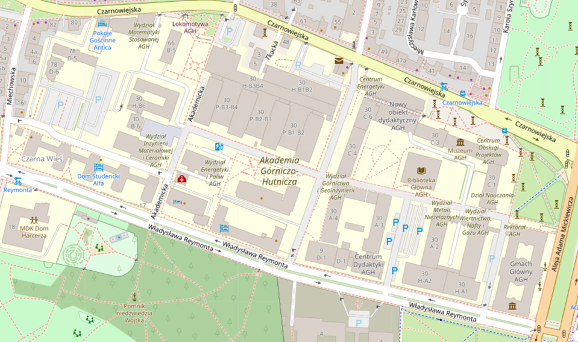
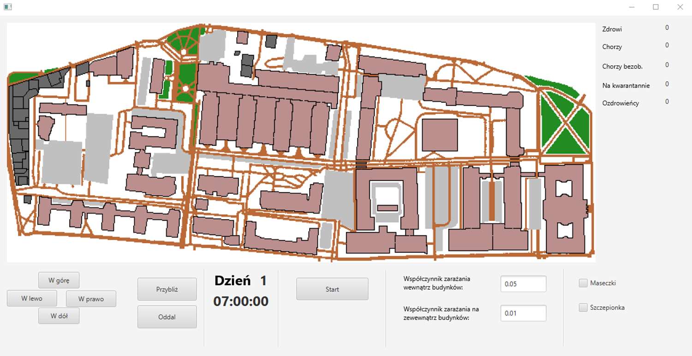
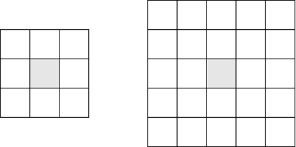
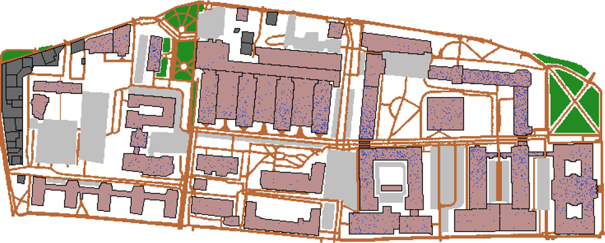
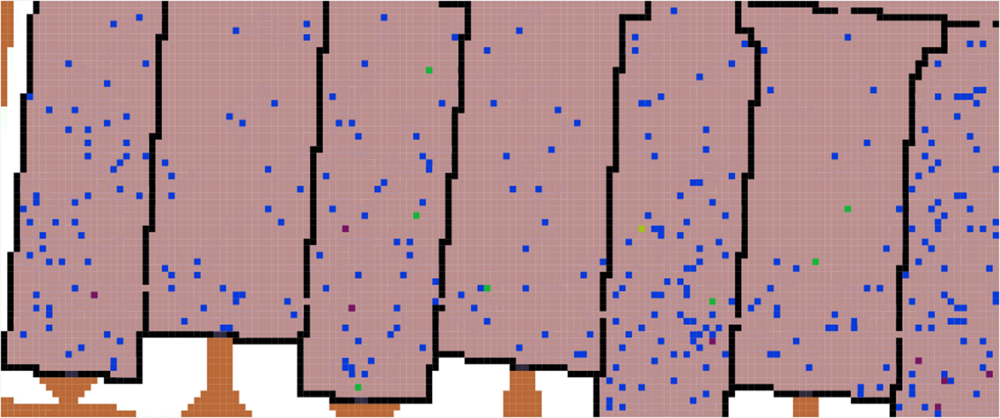
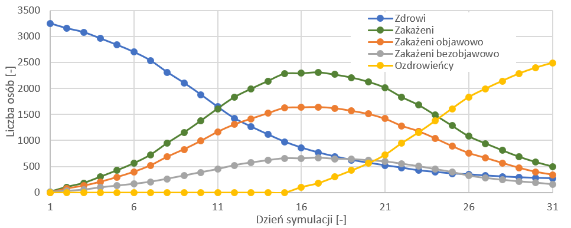

# epidemic-model-simulation
Epidemic model simulation at the AGH University of Science and Technology.

## Table of Contents
* [General info](#general-info)
* [Technologies](#technologies)
* [Details](#details)
  * [Simulation map](#simulation-map)
  * [Graphical user interface](#gui)
  * [Cell states](#cell-states)
  * [Cell neighborhood](#cell-neighborhood)
  * [Model during simulation](#model-during-simulation)
  * [Sample simulation results](#sample-simulation-results)

## General info
* The purpose of this project is to develop and implement an epidemic development model with the use of cellular automata. 
* An important aspect of the work is the assumption of taking into account the interaction of individuals and not a certain population of them. 
* In order to reflect the specificity of the local environment as closely as possible, it was decided to define repetitive routines simulating the working day in the function responsible for the movement of cells. 
* The coefficients of the proposed transition function are modified by the model depending on the location of the cells.
* The simulation scenarios carried out investigate the influence of personal protective measures and vaccination on the epidemic dynamics.

## Technologies
The program is created with:
* Java 11
* JavaFX 16
* Spring Boot 2.4.4

## How to run
* Download JavaFX 16 and add it to the project libraries.

* Run the project with the VM options:

`--module-path "<PATH_TO_JAVAFX-SDK-16>\lib" --add-modules javafx.controls,javafx.fxml`

## Details

### Rules of the simulation

### Simulation map

For the purposes of the project, the AGH University of Science and Technology in Krakow, which is a specific form of enterprise, particularly exposed to the virus, was chosen as the simulation area.

Image 1. The map being simulated

### Graphical user interface

The implemented graphical user interface allows modifying simulation parameters and monitoring its progress.

Image 2. Graphical user interface

### Cell states

Five cell states were proposed in the model.

Image 3. The colors of cells in the following states: healthy, symptomatically ill, asymptomatically ill, convalescence. The last cell represents the crowd cell.

### Cell neighborhood

Cell neighborhood used for the transition function.

Image 5. Neighborhood schemes used for the cells outside, and inside the buildings.

### Model during simulation

Sample screenshots showing the model during the simulation.

Image 6. The whole map during the simulation.

Image 7. Buildings B1-B4 during the simulation.

### Sample simulation results

On the basis of the simulation results it is possible to obtain graphs characterizing the dynamics of the epidemic.

Image 8. The dynamics of the epidemic in a sample simulation scenario.
