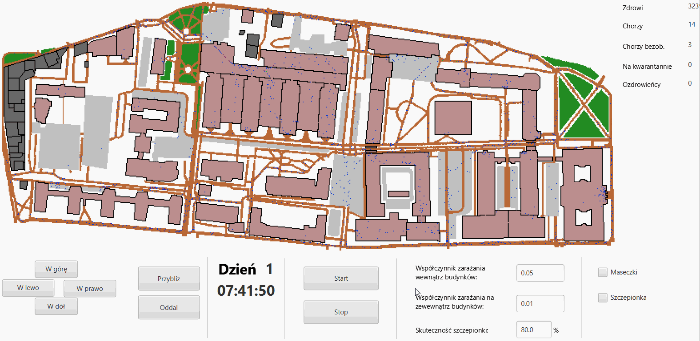
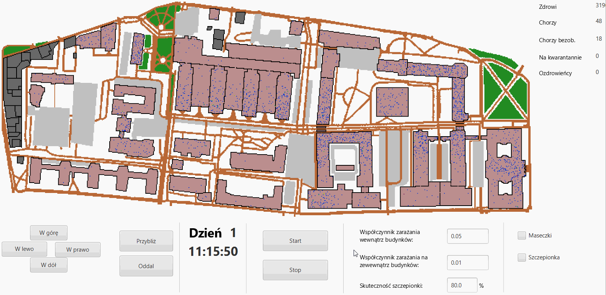
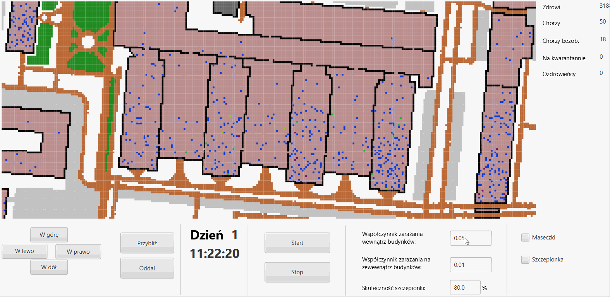

# epidemic-model-simulation
Epidemic model simulation at the AGH University of Science and Technology.

## Table of Contents
* [General info](#general-info)
* [Technologies](#technologies)
* [Details](#details)
  * [Simulation map](#simulation-map)
  * [Graphical user interface](#graphical-user-interface)
  * [Cell states](#cell-states)
  * [Cell neighborhood](#cell-neighborhood)
  * [Model during simulation](#model-during-simulation)
  * [Sample simulation results](#sample-simulation-results)

## General info
* The purpose of this project is to develop and implement an epidemic development model with the use of cellular automata. 
* An important aspect of the work is the assumption of taking into account the interaction of individuals and not a certain population of them. 
* In order to reflect the specificity of the local environment as closely as possible, it was decided to define repetitive routines simulating the working day in the function responsible for the movement of cells. 
* The coefficients of the proposed transition function are modified by the model depending on the location of the cells.
* The simulation scenarios carried out investigate the influence of personal protective measures and vaccination on the epidemic dynamics.

## Technologies
The program is created with:
* Java 11
* JavaFX 16
* Spring Boot 2.4.4

## How to run
* Download JavaFX 16 and add it to the project libraries.

* Run the project with the VM options:

`--module-path "<PATH_TO_JAVAFX-SDK-16>\lib" --add-modules javafx.controls,javafx.fxml`

## Details

### Rules of the simulation

One of the most important elements of the model is the way cells move and the characteristics of the environment in which they function. Below are the most important rules governing the implemented model and the rules by which the movement of cells representing employees is carried out:
1) The area on which the simulation takes place is shown in Image 1.
2) Each pixel of the map represents a unit of area measuring 1 × 1m.
3) Each worker is assigned a home building where he works and spends most of the day.
4) Each day of the simulation has a defined routine of activities performed by moving cells:
   a) The day starts at 7:00 am, when the first employees appear successively at regular intervals on random cells on the edge of the map.
   b) Between 12:00 and 13:00, 20% of employees currently on the map move to catering buildings, and then return to their workplace at 2:00 PM.
   c) Between 4 p.m. and 6 p.m., employees return to the periphery of the map, ending the simulation day.
5) The simulation lasts 31 days.
6) After the end of a given day, symptomatically infected workers are placed in a 14-day quarantine, and as a result do not appear on the map until its completion.
7) Asymptomatically infected units are not quarantined and take part in the following days of the simulation.
8) The total number of worker cells is 3256, of which 10 are initially asymptomatic.
9) Each simulation step - that is the unit of time during which cells can move 1 field - lasts 10 seconds. Each simulation day therefore consists of 3,960 steps.
10) The model does not take into account the presence of students and reflects the situation of university functioning in the form of remote classes.
11) The routes used by the employees on the map are determined by the program at the time of compilation using the breadth-first search algorithm. For each building, a map is generated leading to it, where the cell indicating its door is assigned the highest priority.

### Simulation map

For the purposes of the project, the AGH University of Science and Technology in Krakow, which is a specific form of enterprise, particularly exposed to the virus, was chosen as the simulation area.

  
  <h5 align="center" style="margin-top: -40px; font-style: italic">Image 1. The map being simulated</h5>

### Graphical user interface

The implemented graphical user interface allows modifying simulation parameters and monitoring its progress.

  
  <h5 align="center" style="margin-top: -40px; font-style: italic">Image 2. Graphical user interface</h5>

### Cell states

In the developed model, 5 states related to the employee's cell health state were proposed:
1) Healthy - a healthy cell can become infected symptomatically or asymptomatically.
2) Symptomatically ill - infects other cells during the simulation, at the end of the day on which he become infected he will be put in 14-day quarantine.
3) Asymptomatically ill - infects other cells, will not go to quarantine and will become a healed person after 14 days.
4) In quarantine - a quarantined cell - does not appear on the simulation map.
5) Convalescent - the cell is in this state after returning from quarantine or after having surviving the disease. Cell in this state cannot be re-infected.
   
When a cell is in a given state and on the simulation map, it adopts a color corresponding to that state.

  
  <h5 align="center" style="margin-top: -40px; font-style: italic">Image 3. The colors of cells in the following states: healthy, symptomatically ill, asymptomatically ill, convalescence. The last cell represents the crowd cell.</h5>

### Cell neighborhood

Cell neighborhood used in the transition function for counting the neighbours. The indoor neighborhood is larger due to the fact that it is easier to become infected in buildings.
The more infected neighbors a cell has, the higher its probability of being infected.

  
  <h5 align="center" style="margin-top: -40px; font-style: italic">Image 4. Neighborhood schemes used for the cells outside, and inside the buildings.</h5>

### Model during simulation

Sample screenshots showing the model during the simulation.

  
  <h5 align="center" style="margin-top: -20px; font-style: italic">Gif 1. The start of the simulation and the appearance of the first workers at the edge of the map</h5>

  
  <h5 align="center" style="margin-top: -20px; font-style: italic">Gif 2. Movement of employees to buildings that are their place of work</h5>

  
  <h5 align="center" style="margin-top: -20px; font-style: italic">Gif 3. Model during simulation in the middle of the day</h5>

  
  <h5 align="center" style="margin-top: -20px; font-style: italic">Gif 4. Random movements of workers simulating their work inside buildings</h5>

### Sample simulation results

On the basis of the simulation results it is possible to obtain graphs characterizing the dynamics of the epidemic.

  
  <h5 align="center" style="margin-top: -40px; font-style: italic">Image 5. The dynamics of the epidemic in a sample simulation scenario.</h5>

